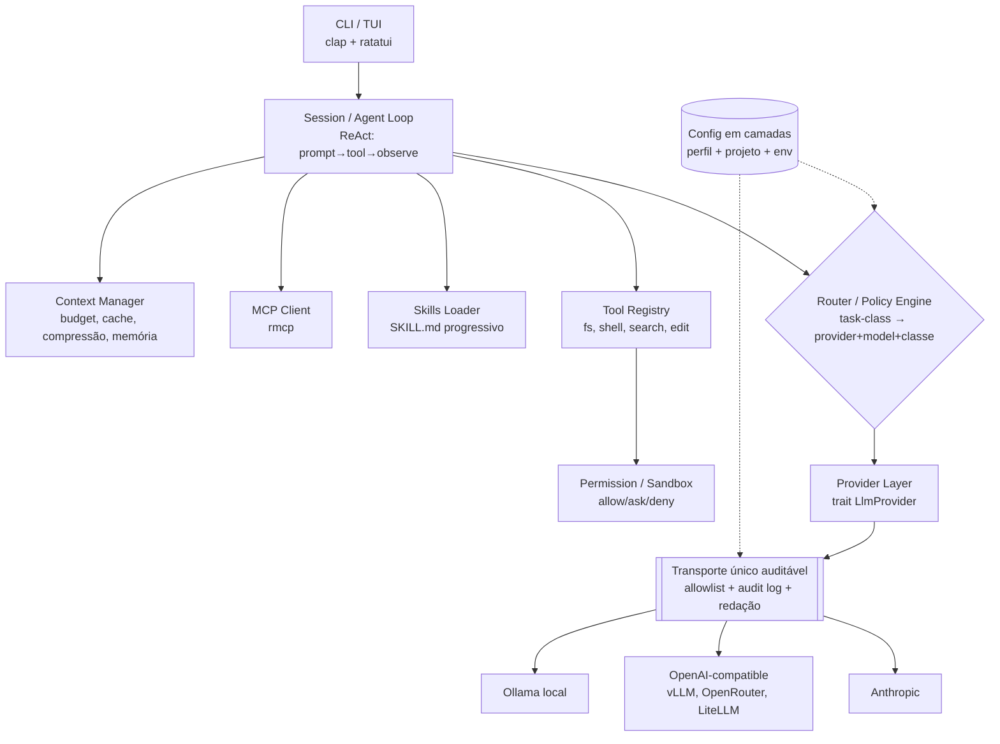
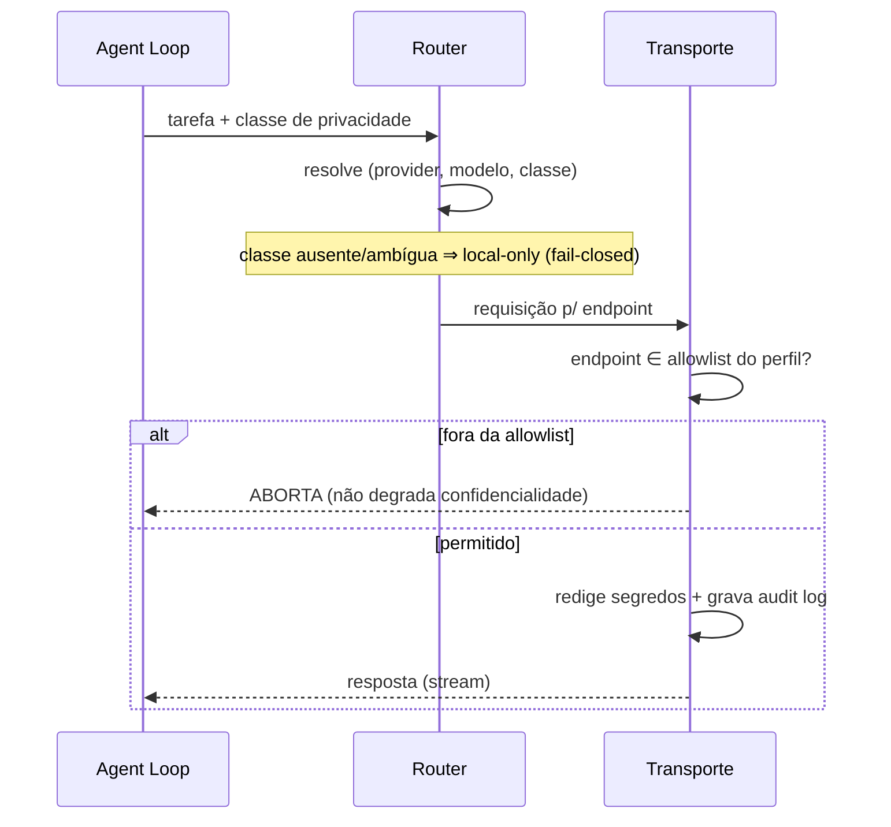

<!-- Caminho relativo: docs/architecture.md -->

# Arquitetura — `agentry`

Agente de codificação em Rust (binário único, portável). O diferencial não é "mais um wrapper
de LLM", e sim a **camada de roteamento/política com classes de privacidade**: o usuário
declara qual modelo/serviço usar para qual classe de tarefa, com egresso de rede controlado e
auditável. Faz par com o `ai-coding-agent-profiles` (camada de política) — ver
[`docs/interop/README.md`](./interop/README.md).

> Decisões estruturais registradas em [`docs/adr/`](./adr/README.md): ADR-0001 (fundação LLM),
> ADR-0002 (privacidade/egresso), ADR-0003 (consumo de profiles), ADR-0004 (sinergia OSS).

## Módulos

## Responsabilidades por módulo

| Módulo | Responsabilidade | Referência |
|---|---|---|
| **Provider Layer** | `trait LlmProvider` (chat, stream, tool-calling, embeddings); adaptadores Anthropic / OpenAI-compatible (inclui gateways LiteLLM, sob classe declarada) / Ollama | ADR-0001, ADR-0006 |
| **Transporte** | Único ponto de saída de rede: allowlist por perfil, *fail-closed*, redação de segredos, audit log, **zero telemetria** | ADR-0002 |
| **Router / Policy** | Mapeia `task-class → (provider, modelo, classe de egresso)`; fallback por custo/latência/disponibilidade | ADR-0002, ADR-0003 |
| **Agent Loop** | Laço ReAct (mensagem → tool-call → observação), streaming, orçamento de tokens | ADR-0001 |
| **Tool Registry + Permission** | fs/shell/search/edit atrás de gate `allow\|ask\|deny` | ADR-0002 |
| **Skills Loader** | Carrega `SKILL.md` por *progressive disclosure* (name+description até acionar) | ADR-0003 |
| **MCP Client** | Reaproveita o ecossistema MCP via `rmcp` (SDK oficial) | — |
| **Context Manager** | Orçamento de tokens, *prompt caching*, compressão de tool-output (padrão `rtk`), memória (padrão `LLM-Wiki`) | ADR-0004 |
| **Config** | Camadas: perfil (`profiles`) + projeto + env | ADR-0003 |

## Fluxo de egresso (o coração da confidencialidade)

## Stack (v0.1)

| Camada | Crate | Nota |
|---|---|---|
| Async | `tokio` | runtime |
| HTTP | `reqwest` (+ SSE) | base do transporte único |
| CLI | `clap` | derive |
| TUI | `ratatui` | marco posterior (v0.1 é CLI streaming) |
| Config | `serde` + `toml` | camadas |
| MCP | `rmcp` | SDK oficial Rust |

> Excluídos do runtime da v0.1 por ADR-0001: frameworks de agente (`rig`) e clientes que
> ocultem chamadas de rede (`genai`).

## Roadmap (resumo)

- **v0.1:** Provider Layer (Anthropic + OpenAI-compatible + Ollama) · Transporte/egresso ·
  Router com classes de privacidade · Tools fs/shell/edit com permissão · CLI streaming.
- **v0.2:** Skills Loader · MCP client · compressão de tool-output.
- **v0.3:** TUI · *prompt caching* · memória estilo `LLM-Wiki`.

O detalhamento vira **micro-tickets** (skill `micro-ticket-planner`) na sequência.
