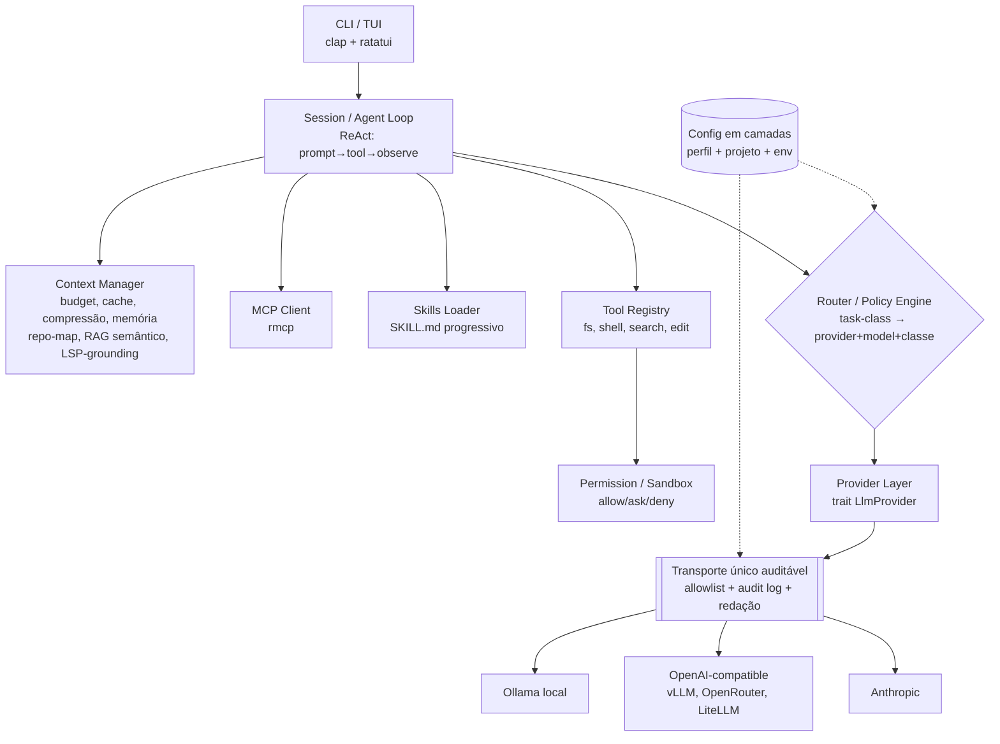
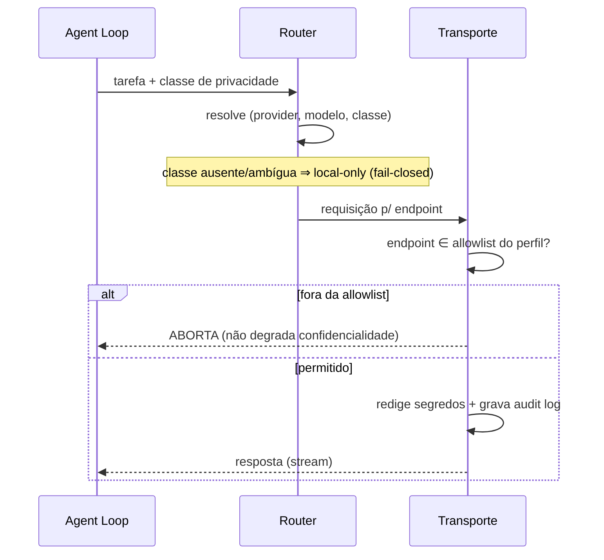

<!-- Caminho relativo: docs/architecture.md -->

# Arquitetura — `agentry`

Agente de codificação em Rust (binário único, portável). O diferencial não é "mais um wrapper
de LLM", e sim a **camada de roteamento/política com classes de privacidade**: o usuário
declara qual modelo/serviço usar para qual classe de tarefa, com egresso de rede controlado e
auditável. Faz par com o `ai-coding-agent-profiles` (camada de política) — ver
[`docs/interop/README.md`](./interop/README.md).

> Decisões estruturais registradas em [`docs/adr/`](./adr/README.md): ADR-0001 (fundação LLM),
> ADR-0002 (privacidade/egresso), ADR-0003 (consumo de profiles), ADR-0004 (sinergia OSS),
> ADR-0010..0013 (especialização de modelos open-source sem fine-tuning: repo-map, RAG
> semântico, saída estruturada, LSP-grounding), ADR-0015 (Reviewer — auditoria semântica).

## Módulos

## Responsabilidades por módulo

| Módulo | Responsabilidade | Referência |
|---|---|---|
| **Provider Layer** | `trait LlmProvider` (chat, stream, tool-calling, embeddings); adaptadores Anthropic / OpenAI-compatible (inclui gateways LiteLLM, sob classe declarada) / Ollama | ADR-0001, ADR-0006 |
| **Transporte** | Único ponto de saída de rede: allowlist por perfil, *fail-closed*, redação de segredos, audit log, **zero telemetria** | ADR-0002 |
| **Router / Policy** | Mapeia `task-class → (provider, modelo, classe de egresso)`; fallback por custo/latência/disponibilidade; task-classes configuráveis (schema, Fase 12) | ADR-0002, ADR-0003, ADR-0008, ADR-0021 |
| **Agent Loop** | Laço ReAct (mensagem → tool-call → observação), streaming, orçamento de tokens; `Reviewer` opcional pós-`Done` (auditoria semântica por tipo, desligado por padrão) | ADR-0001, ADR-0015 |
| **Tool Registry + Permission** | fs/shell/search/edit atrás de gate `allow\|ask\|deny`; futuras: AskUser (pergunta ao humano), web (WebFetch/WebSearch via SearXNG), Glob, shell background — Fase 14 | ADR-0002, ADR-0024..0026 |
| **Skills Loader** | Carrega `SKILL.md` por *progressive disclosure* (name+description até acionar) | ADR-0003 |
| **MCP Client** | Reaproveita o ecossistema MCP via `rmcp` (SDK oficial) | — |
| **Context Manager** | Orçamento de tokens, *prompt caching*, compressão de tool-output (padrão `rtk`), memória (padrão `LLM-Wiki`); repo-map (`tree-sitter`), RAG semântico (`tantivy`+`lancedb`), *grounding* via LSP — especialização de modelos open-source sem fine-tuning, todas ativadas por padrão e desabilitáveis pelo usuário | ADR-0004, ADR-0010..0013 |
| **Config** | Camadas: perfil (`profiles`) + projeto + env | ADR-0003 |

## Fluxo de egresso (o coração da confidencialidade)

## Stack (v0.1)

| Camada | Crate | Nota |
|---|---|---|
| Async | `tokio` | runtime |
| HTTP | `reqwest` (+ SSE) | base do transporte único |
| CLI | `clap` | derive |
| TUI | `ratatui` | marco posterior (v0.1 é CLI streaming) |
| Config | `serde` + `toml` | camadas |
| MCP | `rmcp` | SDK oficial Rust |
| Repo-map | `tree-sitter` (+ gramáticas por linguagem) | extração de símbolos, ADR-0010 |
| RAG semântico | `tantivy` (lexical) + `lancedb` (vetorial) | ambos embutidos, sem servidor, ADR-0011 |
| LSP-grounding | `lsp-types` + `lsp-server` | cliente LSP; fala com *language server* já instalado, ADR-0013 |

> Excluídos do runtime da v0.1 por ADR-0001: frameworks de agente (`rig`) e clientes que
> ocultem chamadas de rede (`genai`).

## Roadmap

O que foi entregue (Fases 1–10) e o que vem a seguir estão nos roadmaps versionados
(`docs/roadmap-v0.1.md` … `roadmap-v0.6.md`) e no **mapa de visão de longo prazo**:
[`docs/roadmap-longo-prazo.md`](./roadmap-longo-prazo.md) — que **supersede** o esboço
v0.2/v0.3 que ficava aqui.

Resumo da direção: **Fase 11** `.agentryignore`/`.gitignore` (ADR-0020) · **Fase 12**
configuração completa de task-class + convenção autoexplicativa (ADR-0021/0022) · **Fase 13**
memória de projeto AGENTS.md + Skills (ADR-0023, fecha ADR-0003) · **Fase 14** tools
essenciais — AskUser, web/SearXNG, Glob, shell background (ADR-0024..0026) · **Fase 15** TUI
`ratatui` (ADR-0027) · **Fase 16** MCP client `rmcp` (ADR-0028) · **Fase 17** uso de tokens
visível na sessão (ADR-0029) · **Fase 18** checkpoints e *undo* de mudanças de arquivo
(ADR-0030) · **Fase 19** subagentes/orquestração (ADR-0031) · **Fase 20** memória de projeto
explícita entre sessões (ADR-0032) · **Fase 21+** multimodal, bloqueada por um *guardrail* de
imagem ainda não construído.

O detalhamento de cada fase vira **micro-tickets** (skill `micro-ticket-planner`) ao iniciar.
